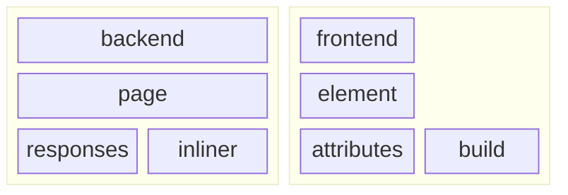

# the onlyweb framework ✨👁✨

 [](https://codecov.io/gh/daniellacosse-code/onlyweb.dev) [](https://codeclimate.com/github/daniellacosse-code/onlyweb.dev/maintainability)

https://github.com/daniellacosse-code/onlyweb.dev/assets/3759828/cd94622b-aedb-4831-bb52-9f6b3974b7cb

## overview

**the onlyweb framework** is a lightweight, server-side rendering framework for [WebComponents](https://developer.mozilla.org/en-US/docs/Web/API/Web_Components), built on top of the [Deno](https://deno.land/) runtime. It was designed for the [onlyweb.dev](https://onlyweb.dev) application with a focus on performance and transparency. Jump to ["concepts"](#concepts) for the breakdown.

### prerequisites

A basic understanding of native web development. MDN has a great [introduction to the web](https://developer.mozilla.org/en-US/docs/Learn/Getting_started_with_the_web) that you can follow.

## features

- server-side rendering for WebComponents, as already mentioned
- zero dependencies, apart from Deno
- css reset scoped to WebComponents by default
- react-like rendering, without the virtual dom
- lit-like templating, without the need for a build step
- robust logging
- lightweight i18n
- streamlined service worker and PWA deployment
- user agent checking (for when feature detection isn't enough)

### benchmarks


```
cpu: Apple M1 Max
runtime: deno 1.40.5 (aarch64-apple-darwin)

file:///only-web/framework/bench.js
benchmark                     time (avg)        iter/s             (min … max)       p75       p99      p995
------------------------------------------------------------------------------ -----------------------------
benchHandleSmallTemplate      24.19 ns/iter  41,347,496.2    (21.3 ns … 33.52 ns) 25.55 ns 31.17 ns 31.74 ns
benchHandleLargeTemplate      14.72 µs/iter      67,920.9  (13.21 µs … 447.33 µs) 13.75 µs 25.25 µs 88.25 µs
escapeSmallString            588.03 ns/iter   1,700,603.5 (570.98 ns … 618.44 ns) 592.58 ns 618.44 ns 618.44 ns
escapeLargeString            687.48 µs/iter       1,454.6 (656.75 µs … 985.88 µs) 670.17 µs 943.21 µs 959.58 µs
minifySmallString            320.09 ns/iter   3,124,130.2  (314.2 ns … 346.37 ns) 325.17 ns 341.35 ns 346.37 ns
minifyLargeString            144.68 µs/iter       6,911.7 (138.29 µs … 441.88 µs) 140.12 µs 333.5 µs 340.17 µs
parseUserAgent               524.01 ns/iter   1,908,352.7 (513.68 ns … 555.03 ns) 525.63 ns 544.58 ns 555.03 ns
```

## concepts



The **onlyweb framework** is split into two main environments: the backend and the frontend. These environments have similar, complementary APIs that are designed to work together.

### backend

The backend server serves content via Deno. Key concepts:

1. **Page**: encapsulates a set of possible responses to an endpoint and selects one based on context. The **Page** also manages the **Inliner**.
2. **Response**: an object that represents how the Deno HTTP web server will respond to a given Request. [Learn more about HTTP here.](https://developer.mozilla.org/en-US/docs/Web/HTTP)
3. **Inliner**: _inlines_ content into a **Response**, building the static content you wish to respond with just in time.

### frontend

The frontend renders content in the browser via WebComponents. Key concepts:

1. **Element**: an HTML tag representing some meaningful section or component of your application. Each custom **Element** is basically like a little, nested website. [Learn more about HTML Elements here](https://developer.mozilla.org/en-US/docs/Web/HTML/Element).
2. **Attribute**: a property of an **Element** that can be set and read. Attributes are used to pass data to **Elements**. [Learn more about HTML Attributes here](https://developer.mozilla.org/en-US/docs/Web/HTML/Attributes).
3. **Build**: the process of creating an **Element** from a set of **Attributes**. This is where you define the structure of your **Element**.

This is abstract, so let's walk through a simple example to make things more concrete.

> [!TIP]
> When in doubt, everything in the framework has JSDoc annotations - just look at the source!

### basic tutorial

1. Start by registering the main **Page** we're going to serve from the backend:

```js
import Backend from "https://raw.githubusercontent.com/daniellacosse-code/onlyweb.dev/main/framework/backend/module.js";

Backend.Page.Register("/", {
  handleRequest: async (request) => Backend.Page.Response.html`
    <body>
      <h1>Your search is: ${request.url.search}</h1>
    </body>
  `;
  }
);
```

2. The default response has no metadata, so external sites won't know how to display it.
   Create an **Inliner** to add some:

```js
Backend.Page.Register("/", {
  handleRequest: async (request) => {
    const inliner = await Backend.Page.Inliner(request);

    return Backend.Page.Response.html`
      <head>
        ${inliner.metadata({
          title: "what's my search?",
          description: "a simple page that shows the search query"
        })}
      </head>
      <body>
        <h1>Your search is: ${request.url.search}</h1>
      </body>
    `;
  }
});
```

3. Our page only works in English. Provide the **Inliner** with [a folder of translations like this one](../app/assets/messages/) so we can support those languages:

```js
Backend.Page.Register("/", {
  handleRequest: async (request) => {
    const inliner = await Backend.Page.Inliner(
      request,
      "%path/to/messages/folder%"
    );

    return Backend.Page.Response.html`
      <head>
        ${inliner.metadata({
          title: inliner.message("what's my search?"),
          description: inliner.message(
            "a simple page that shows the search query"
          )
        })}
      </head>
      <body>
        <h1>${inliner.message("Your search is:")} ${request.url.search}</h1>
      </body>
    `;
  }
});
```

4. We want to be able to easily copy our search string to the clipboard. We'll have to create a new frontend **Element** to do this. Here's that initial file. Note how we're now importing via the root path:

```js
import Frontend from "/framework/frontend/module.js";

Frontend.Element.Register("copy-code", {
  buildAttributes: { copied: Boolean, ["copy-message"]: String, code: String },
  // Note that the html template tag here is different than the Backends'
  handleBuild: ({ code, copied, ["copy-message"]: copyMessage }) => Frontend
    .Element.html`
    <style>
      div {
        display: relative;
      }
      code {
        font-family: monospace;
        font-size: 1rem;
        text-overflow: ellipsis;
      }
      div[popover] {
        display: absolute;
        top: 0;
        left: 0;
      }
    </style>
    <div>
      <code>${code}</code>
      <div popover>${copyMessage}</div>
    </div>
  `
});
```

5. The onlyweb framework simply wraps the existing Event API to handle I/O. To do the copy, listen for a click event on mount:

```js
Frontend.Element.Register("copy-code", {
  buildAttributes: { copied: Boolean, ["copy-message"]: String, code: String },
  handleMount: () => {
    this.addEventListener("click", () => {
      if (this.buildAttributes.copied) {
        return;
      }

      globalThis.navigator.clipboard.writeText(this.buildAttributes.code);

      this.querySelector("div[popover]").togglePopover();
      this.buildAttributes.copied = true;
    });
  },
  handleBuild: ({ code, copied, ["copy-message"]: copyMessage }) => Frontend
    .Element.html`
    <style>
      div {
        display: relative;
      }
      code {
        font-family: monospace;
        font-size: 1rem;
        text-overflow: ellipsis;
      }
      div[popover] {
        display: absolute;
        top: 0;
        left: 0;
      }
    </style>
    <div>
      <code>${code}</code>
      <div popover>${copyMessage}</div>
    </div>
  `
});
```

6. Now to actually use our `<copy-code>` **Element** we must inline it into the **Page**. You do that like so:

```js
Backend.Page.Register("/", {
  handleRequest: async (request) => {
    const inliner = await Backend.Page.Inliner(
      request,
      "%path/to/messages/folder%"
    );

    return Backend.Page.Response.html`
      <head>
        ${inliner.metadata({
          title: inliner.message("what's my search?"),
          description: inliner.message(
            "a simple page that shows the search query"
          )
        })}
        ${inliner.elements("%path/to/element/copy-code.js%")}
      </head>
      <body>
        <h1>${inliner.message("Your search is:")} ${request.url.search}</h1>

        <copy-code code="${request.url.search}" copy-message="${inliner.message(
      "Copied!"
    )}"></copy-code>
      </body>
    `;
  }
});
```

7. HTML popovers aren't super supported yet, so let's indicate that in our pages' requirements:

```js
Backend.Page.Register("/", {
  requirements: {
    engine: {
      Firefox: "125",
      Safari: "17.0"
    }
  },
  handleRequest: async (request) => {
    const inliner = await Backend.Page.Inliner(
      request,
      "%path/to/messages/folder%"
    );

    return Backend.Page.Response.html`
      <head>
        ${inliner.metadata({
          title: inliner.message("what's my search?"),
          description: inliner.message(
            "a simple page that shows the search query"
          )
        })}
        ${inliner.elements("%path/to/element/copy-code.js%")}
      </head>
      <body>
        <h1>${inliner.message("Your search is:")} ${request.url.search}</h1>

        <copy-code code="${request.url.search}" copy-message="${inliner.message(
      "Copied!"
    )}"></copy-code>
      </body>
    `;
  }
});
```

8. Finally, create a new file for your app's main entrypoint. Import your page and start the backend!

```js
import Backend from "https://raw.githubusercontent.com/daniellacosse-code/onlyweb.dev/main/framework/backend/module.js";

import "%path/to/page.js%";

Backend.start({ port: 8080 });
```

### \[WIP\] full example

See the [onlyweb.dev application source](../app/) for a full example!
